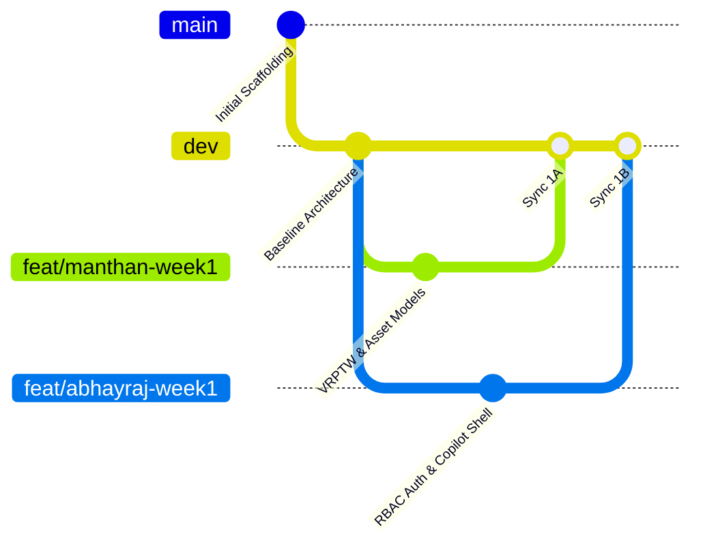

# AI Fleet Route Optimizer

[](https://fastapi.tiangolo.com)
[](https://nextjs.org)
[](https://www.python.org)
[](https://www.typescriptlang.org)
[](https://tailwindcss.com)
[](https://www.sqlalchemy.org)
[](https://langchain-ai.github.io/langgraph/)

An enterprise-grade AI solution for Fleet Route Optimization that addresses critical operational efficiency, multi-stop routing complexity (Vehicle Routing Problem with Time Windows — VRPTW), and dynamic dispatch automation in the Logistics and Supply Chain sector.

The platform fuses **deterministic graph optimization algorithms (DSA)** with **multi-agent generative AI (LangGraph)** and **Retrieval-Augmented Generation (RAG)** grounded in enterprise logistics SOPs and transport regulations.

---

## Authors & Engineering Leads

- **Manthan Nimodiya** — *Track A Lead: Optimization & Operations (VRPTW Solver, Leaflet Map, FSM Telemetry, Driver View, Route Metrics)*
- **Abhayraj Jaiswal** — *Track B Lead: GenAI, RAG & Platform Governance (LangGraph Copilot, RAG Vector Store, RBAC Auth, Executive Dashboard, Audit Log)*

---

## Architectural Highlights

```
┌─────────────────────────────────────────────────────────────────────────────┐
│                      AI FLEET ROUTE OPTIMIZER ARCHITECTURE                  │
└─────────────────────────────────────────────────────────────────────────────┘

 [Frontend: Next.js 14 / TypeScript / Tailwind CSS / Leaflet]
  ├── Dispatcher Command Center UI (Live Map, Split Manifest, Resequencing)
  ├── AI Copilot Sliding Drawer (Multi-Turn Chat, Execution Traces, Action Cards)
  ├── Mobile-Responsive Driver View (Stop-by-Stop Cards, One-Tap Status)
  ├── Executive Analytics Dashboard (OTIF Rate, Fuel Burn, Ton-Km Cost)
  └── Compliance Knowledge Inspector (SOP Search, Hazmat Citations)
                                 │
                                 ▼ (REST API / JWT Auth)
 [Backend: FastAPI / Python 3.14 / SQLAlchemy 2.0]
  ├── Core Infrastructure: Config, Security (Bcrypt/JWT), Unified Logger
  ├── Multi-Mode DB Layer: SQLite (Zero-Config Local) & PostgreSQL (Production)
  │
  ├── Track A Engines (Manthan Nimodiya):
  │   ├── VRPTW Solver (Clarke-Wright Savings + 2-opt Heuristic < 5s for 50 stops)
  │   ├── Spatial Engine (Haversine Matrix & Road Detour Correction)
  │   ├── In-Transit State Machine (FSM: UNASSIGNED → IN_TRANSIT → COMPLETED)
  │   └── Dynamic Downstream ETA Recalculation Engine
  │
  └── Track B Engines (Abhayraj Jaiswal):
      ├── LangGraph Multi-Agent Copilot (Router, Optimization & Policy Agents)
      ├── RAG Compliance Engine (Cosine Similarity Vector Store & Citations)
      ├── Strict Grounding Guardrail ("Policy not found in verified knowledge base")
      └── Immutable Audit Trail (Tamper-Proof State & Override Logging)
```

---

## Feature Capabilities (PRD Alignment)

| Feature | PRD Priority | Description |
| :--- | :---: | :--- |
| **Role-Based Auth & RBAC (US-001)** | `MUST` | Secure password hashing (Bcrypt/PBKDF2) and signed JWT tokens for `Admin`, `Fleet Manager`, `Dispatcher`, and `Driver`. |
| **Fleet Asset Management (US-002)** | `MUST` | Full CRUD operations for Vehicles (payload, volume, fuel), Drivers (shifts, licenses), Hubs/Depots, and Shipments. |
| **Deterministic VRPTW Solver (US-003)** | `MUST` | DSA-based multi-vehicle routing solver with capacity, time windows `[open, close]`, and driver shift constraints (&lt;5s benchmark for 50 stops). |
| **Interactive Map & Workspace (US-004)** | `MUST` | Leaflet map with OpenStreetMap tiles, color-coded vehicle polylines, sequenced stop pins, and drag-and-drop stop reordering with instant ETA re-computation. |
| **Multi-Agent AI Copilot (US-005)** | `MUST` | LangGraph multi-agent system (Router Agent, Optimization Agent, Policy Agent) formulating structured confirmation proposals before mutating route state. |
| **RAG Compliance Engine (US-006)** | `MUST` | Grounded in Lewis et al. (2020) and WikiQA principles. Vectorized logistics SOPs (Hazmat ADR/DOT, driver rest mandates) with source citations and confidence scores. |
| **Operational KPI Dashboard (US-007)** | `SHOULD` | Executive dashboard tracking On-Time In-Full (OTIF) rate, average transit duration, fuel burn index, and cost per ton-kilometer with CSV/PDF exports. |
| **Dynamic Telemetry & FSM (US-008)** | `MUST` | Real-time driver action updates (`ARRIVED`, `COMPLETED`, `FAILED`, `DELAYED`), dynamic downstream ETA updates, and immutable audit logs. |

---

## Balanced Two-Person Team Allocation

To maximize engineering growth and maintain parallel momentum without merge conflicts, work is divided into **Vertical Feature Slices** where both engineers build full-stack features:

| Dimension | Track A: Manthan Nimodiya | Track B: Abhayraj Jaiswal |
| :--- | :--- | :--- |
| **Domain** | **Optimization, Routing & Live Operations** | **GenAI Copilot, Compliance & Governance** |
| **Backend** | VRPTW Solver, Distance Matrix, FSM Engine | LangGraph Agents, RAG Vector Store, RBAC Auth |
| **Frontend** | Leaflet Map, Manifest Drag-and-Drop, Driver UI | Copilot Drawer, Proposal Cards, KPI Dashboard |
| **Database** | Fleet Models (Vehicle, Driver, Hub, Route, Stop) | User Model, AuditLog Model, Policy Embeddings |
| **Algorithms** | Clarke-Wright Savings, 2-opt, Haversine | LLM Prompt Chains, Cosine Vector Retrieval |

For complete weekly details, refer to [team_work_split.md](team_work_split.md) and [conflict_free_architecture_guide.md](conflict_free_architecture_guide.md).

---

## Directory Structure

```
fleet-route-opt/
├── backend/
│   ├── app/
│   │   ├── core/               # Shared: Config, Database engine, Security, Logging
│   │   ├── models/             # ORM models (fleet.py, route.py vs. user.py, audit.py)
│   │   ├── schemas/            # Pydantic data schemas for validation
│   │   ├── services/
│   │   │   ├── optimizer/      # Track A: VRPTW Solver, Haversine Matrix, Clustering
│   │   │   ├── copilot/        # Track B: LangGraph StateGraph, Router, Policy Agents
│   │   │   └── rag/            # Track B: Vector Store, SOPs, Knowledge Base
│   │   ├── api/v1/             # REST API routes (fleet, routes, auth, copilot, etc.)
│   │   └── main.py             # FastAPI entrypoint, lifespan, CORS, and root endpoints
│   ├── tests/                  # Pytest test suites (test_health.py, solver, rag, fsm)
│   └── requirements.txt        # Python backend dependencies
│
├── frontend/
│   ├── src/
│   │   ├── app/                # Next.js App Router (dashboard, routes, tracking, copilot, etc.)
│   │   ├── components/         # LeafletMap, CopilotDrawer, Navbar, Sidebar, KpiCards
│   │   └── lib/
│   │       ├── types.ts        # Master TypeScript Data Contracts (Shared)
│   │       └── api.ts          # Centralized API client with JWT bearer handling
│   ├── package.json            # Node.js dependencies
│   ├── tailwind.config.js      # Tactical command center palette (#0b0f19)
│   └── tsconfig.json           # TypeScript configuration
│
├── _PRD.pdf                    # Official Product Requirements Document
├── conflict_free_architecture_guide.md  # Parallel development engineering protocol
├── milestones_tracker.md       # Live 16-week progress tracker
├── team_work_split.md          # Two-person engineering allocation breakdown
├── weekly_work_log.md          # Plain English weekly project journal
└── README.md                   # Main documentation (this file)
```

---

## Getting Started

### Prerequisites
- **Python**: `3.11+` (Fully compatible with Python `3.14`)
- **Node.js**: `v18.0+` (Tested on `v20` / `v22` / `v25`)
- **Git**: `2.30+`

---

### 1. Backend Setup (FastAPI)

```bash
# Navigate to backend directory
cd backend

# Create and activate virtual environment (optional but recommended)
python -m venv venv
# On Windows:
.\venv\Scripts\activate
# On Linux/macOS:
source venv/bin/activate

# Install dependencies
python -m pip install -r requirements.txt

# Run automated tests
python -m pytest tests/ -v

# Start the development server
python -m uvicorn app.main:app --reload --host 0.0.0.0 --port 8000
```

- **Interactive API Documentation (Swagger)**: [http://localhost:8000/docs](http://localhost:8000/docs)
- **Alternative API Docs (ReDoc)**: [http://localhost:8000/redoc](http://localhost:8000/redoc)
- **Health Probe**: [http://localhost:8000/api/v1/health](http://localhost:8000/api/v1/health)

---

### 2. Frontend Setup (Next.js 14)

```bash
# Navigate to frontend directory
cd frontend

# Install dependencies
npm install

# Start the development server
npm run dev
```

- **Command Center Dashboard**: [http://localhost:3000](http://localhost:3000)

---

## Git Workflow for Two Engineers



1. **Pull `dev` at the start of every session**:
   ```bash
   git checkout dev
   git pull origin dev
   ```
2. **Work inside your feature branch**:
   - Manthan: `git checkout -b feat/manthan-week{N}-{feature}`
   - Abhayraj: `git checkout -b feat/abhayraj-week{N}-{feature}`
3. **End-of-Week Integration Sync**:
   - Open Pull Request into `dev`.
   - Peer review and approve.
   - Run automated tests (`pytest` and `npm test`).
   - Merge into `dev`.

---

## Scientific Principles & Citations

1. **RAG Architecture**: Lewis, P., et al. (2020). *Retrieval-Augmented Generation for Knowledge-Intensive NLP Tasks*. [arXiv:2005.11401](https://arxiv.org/abs/2005.11401).
2. **Benchmark QA**: Microsoft Research. *WikiQA: A Challenge Evaluation Dataset for Open-Domain Question Answering*. [WikiQA Dataset](https://www.microsoft.com/en-us/research/project/wikiqa-dataset/).
3. **VRPTW Heuristics**: Clarke, G. and Wright, J.W. (1964). *Scheduling of Vehicles from a Central Depot to a Number of Delivery Points*. Operations Research.

---

## License

Enterprise Proprietary — Copyright © 2026 Abhayraj Jaiswal & Manthan Nimodiya. All rights reserved.